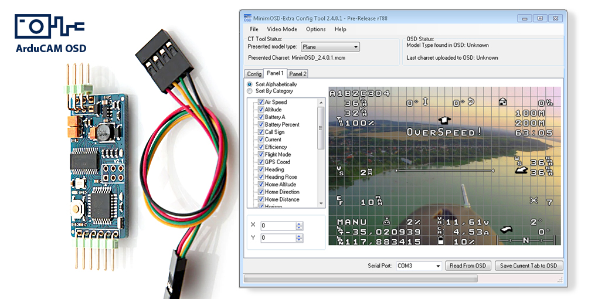

ArduCAM OSD Project
===================

This project is about providing camera solutions for UAV projects as telemetry over OSD and/or camera control, etc.
As the project is based on Arduino, it could be hacked to many other applications.

Welcome to the ArduCam OSD Project!

--Sandro Benigno

[ Automatically exported from code.google.com/p/arducam-osd ]
